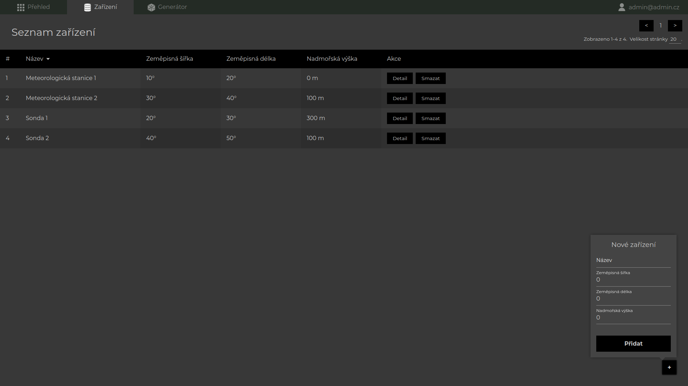
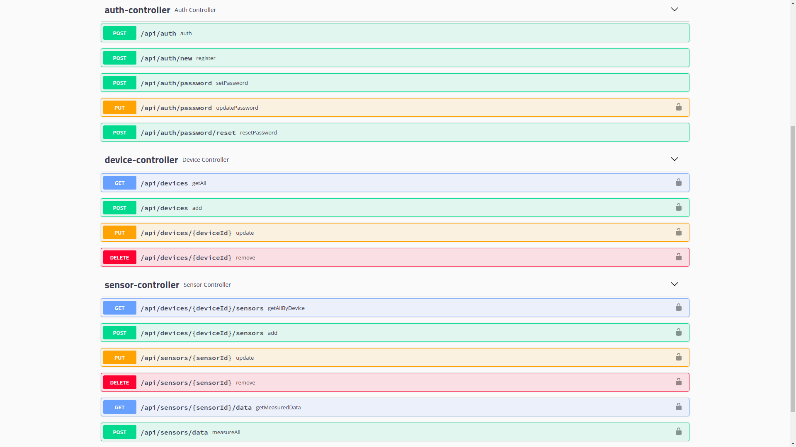
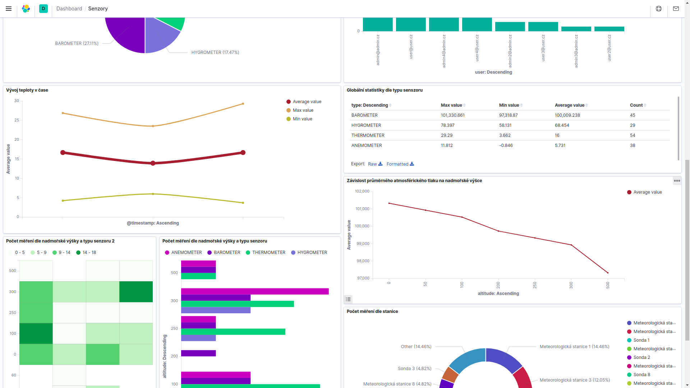

School project for practicing following technologies:

- Docker,
- Spring,
- Elastic Search,
- Kibana,
- Logstash.

Run `docker-compose up` from root of project, then these routes will be available:

 - web app (http://localhost:3000, login: admin@admin.cz, password: nnpia),
 
  
 
 - REST API docs (http://localhost:8080/swagger-ui.html),
 
  
 
 - Kibana (http://localhost:5601).
 
 